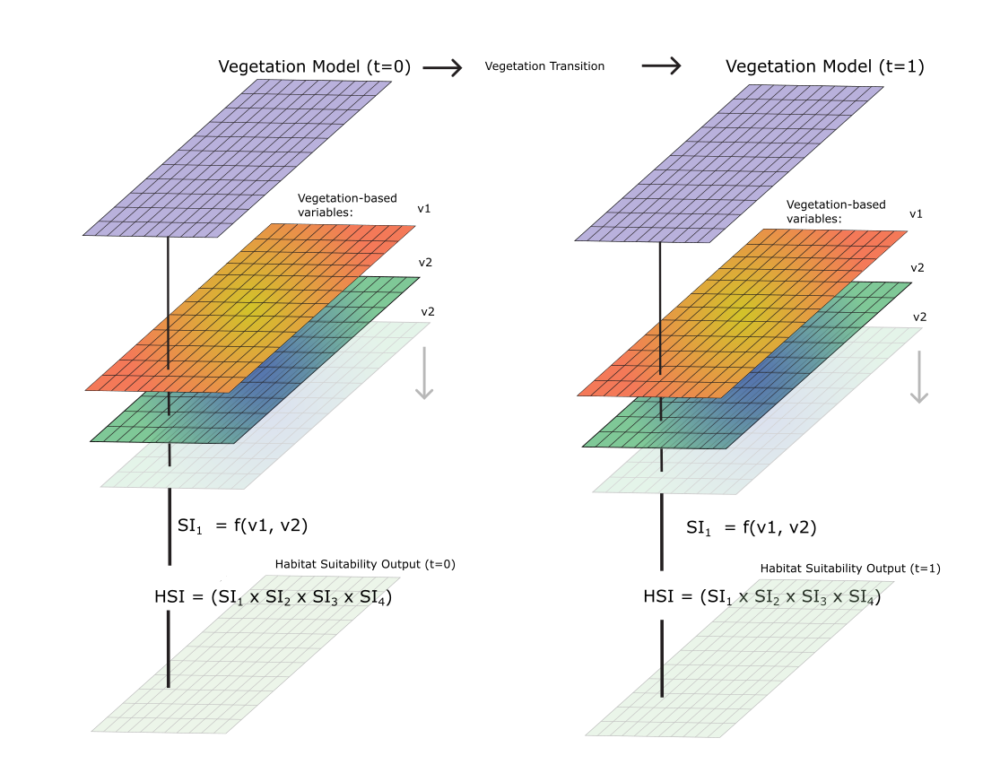

# CPRA HSI & Vegetation Modeling Tasks
___
This repo contains code for the Habitat Suitability Modeling (HSI) task, and the vegetation transition model, which serves as a partial basis for the HSI data input.

The processing code will be designed to facillitate these tasks:

1. General Data Preprocessing & Model Conceptualization
2. Calculate Transitions
3. Pre-process HSI Model inputs (e.g., Bald eagle)
4. Build/script HSI models 
5. Run HSI models output at each timestep/period
6. Visualize Output

___
### `VegProcessor/`
Description: This folder contains code for processing inputs and executing the vegetation transition model, as well as the subsequent HSI model implementation. It handles input data preprocessing, vegetation type transitions based on environmental conditions (e.g., water depth, salinity), and generating outputs for analysis and visualization. The `VegTransition` model is designed to simulate vegetation dynamics over time and provide inputs for Habitat Suitability Index (HSI) models.

#### Contents:
- `veg_transition.py`: Framework for vegetation transition modeling, implementing rules and conditions for vegetation type changes over time. The `VegTransition` class is initialized with a `config.yaml` which defines the model parameters. The `run()` method executes the model.
- `hsi.py`: Framework for running the HSI models over the domain. `HSI` is a child class of `VegTransition` and inherits much of it's functionality for updating state variables over time.
- `veg_logic.py`: Detailed implementation of vegetation transition rules, handling specific conditions and constraints for various vegetation types.
- `test.py`: Unit testing of vegetation zone logic.
- `utils.py`: General utility functions for working with file paths, datasets, and common logic used throughout the model. Includes functions to generate the 25-year sequenves. Also includes runtime testing that occurs during execution.
- `plotting.py`: Tools for visualizing input data, transition results, and model outputs.
- `run.ipynb`: Example workflow demonstrating how to execute the vegetation model, HSI models, and post processing of results.

___
#### `VegProcessor/configs`

- Configuration files for defining a vegetation transition model run.

___
#### `VegProcessor/sequences`
- CSV files defining the ordering of analog years with the 25 year sequences.

___
#### `VegProcessor/species_hsi`
Description: this folder contains the individual species HSI logic.
#### Contents:
- `alligator.py`
- `bald_eagle.py`
- `bass.py`
- `gizzardshad.py`

___
### Setup for Model Runs & Development

#### **1. Clone the Repository**

Ensure **Git** is installed, then open a terminal and run:

```bash
git clone https://github.com/LynkerIntel/cpra-hsi.git
cd cpra-hsi
```

---

#### **2. Create and Activate a Conda Environment**

An environment file, `environment_multiplatform.yml`, is provided. Create the Conda environment using:

```bash
conda env create -f environment/environment_multiplatform.yml
```

Activate the environment:

```bash
conda activate cpra_env
```

This installs the necessary dependencies, including:

- **GIS & Spatial Analysis**: `gdal`, `shapely`, `geojson`, `geopandas`, `rioxarray`, `cartopy`, `geocube`
- **Data Processing & Visualization**: `xarray`, `numpy`, `pandas`, `matplotlib`, `plotly`, `dash`, `dash-bootstrap-components`
- **Cloud & Utility Tools**: `boto3`, `requests`, `python-dotenv`
- **Python & Development Tools**: `mypy`, `isodate`, `future`, `pyyaml`, `ipykernel`, `nbformat`, `appdirs`

The environment is currently not defined with pinned versions, in order to maximize capatibility. Conda will install the latest version of packages that does not create conflicts. This will change to pinned versions.


---

#### **3. Configure the Model**

In order to run scenarios (i.e. base or sea level rise), 25-year sequences must be generated from the analog years, using  `utils.generate_combined_sequence()`. Be aware that these sequences take up substantial space (~ 20 gig). Next, edit the configuration files in `./configs/`, pointing each path to a local file.

- `VegProcessor/veg_config_**`: Specifies vegetation transition model settings, raster data paths, and output locations.
- `VegProcessor/hsi_config_**`: Defines parameters for running the Habitat Suitability Index model.

##### These steps are demonstrated in `./VegProcessor/run.ipynb`
---
To execute the vegetation transition model:

```python
from VegProcessor.veg_transition import VegTransition

# Initialize the model with a config file
veg_model = VegTransition(config_file="./configs/veg_config.yaml")

# Run the model
veg_model.run()
```
##### These steps are demonstrated in `./VegProcessor/run.ipynb`
---
Keep in mind that the HSI models depend on the `VegTransition` output, and must always be executed second. To run the **Habitat Suitability Index (HSI)** model:

```python
from VegProcessor.hsi import HSI

# Initialize the HSI model
hsi_model = HSI(config_file="./configs/hsi_config.yaml")

# Run the model
hsi_model.run()
```
##### These steps are demonstrated in `./VegProcessor/run.ipynb`
---

## **7. Debugging & Logs**

- Logs are stored in `output/run-metadata/simulation.log`
- Check logs if the model fails to run or if there are errors in output files.
- If running `VegTransition` or `HSI` in a notebook, the class instance (i.e. `hsi_model` as defind above) holds all of the interediate and QA/QC arrays as attributes. For example: `hsi_model.alligator.si_1` is the location of suitability index #1 array for alligator. This array be be visualized by:

    ```python
    import matplotlib.pyplot as plt

    plt.matshow(hsi_model.alligator.si_1)
    plt.colorbar()
    ```

---

## **8. Cleaning Up**

To deactivate the Conda environment:

```bash
conda deactivate
```

To remove the environment completely:

```bash
conda remove --name cpra_env --all -y
```
___
#### VegTransition
