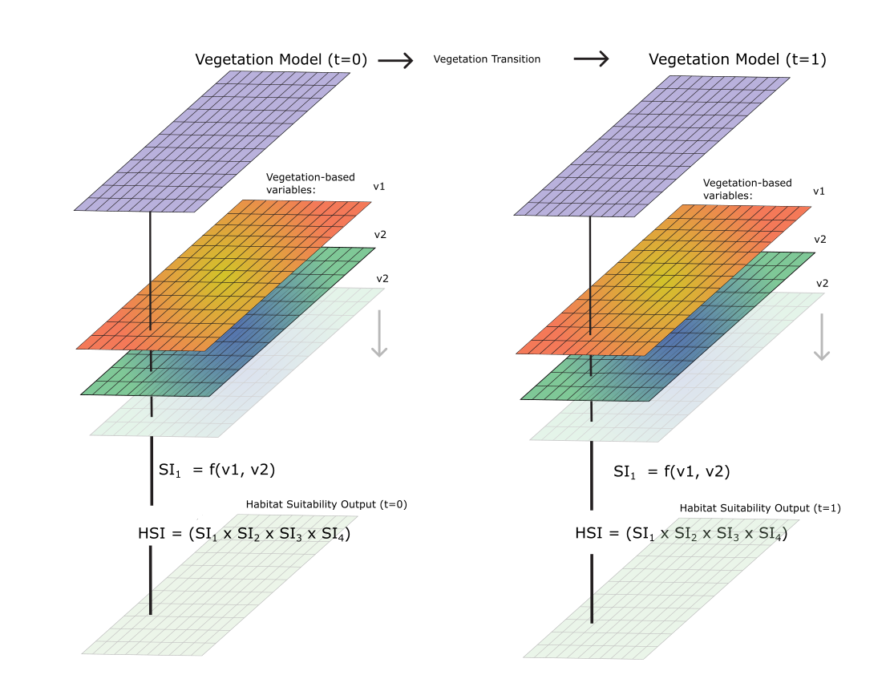

# CPRA HSI & Vegetation Modeling Tasks
___
This repo contains code for the Habitat Suitability Modeling (HSI) task, and the vegetation transition model, which serves as a partial basis for the HSI data input.

The processing code will be designed to facillitate these tasks:

1. General Data Preprocessing & Model Conceptualization
2. Calculate Transitions
3. Pre-process HSI Model inputs (e.g., Bald eagle)
4. Build/script HSI models 
5. Run HSI models output at each timestep/period
6. Visualize Output

___
### `VegProcessor/`
Description: This folder contains code for processing inputs and executing the vegetation transition model. It handles input data preprocessing, vegetation type transitions based on environmental conditions (e.g., water depth, salinity), and generating outputs for analysis and visualization. The model is designed to simulate vegetation dynamics over time and provide inputs for Habitat Suitability Index (HSI) modeling.

#### Contents:
- `preprocess.py`: Utilities for data preprocessing, including input preparation and validation for vegetation modeling.
- `veg_transition.py`: Core logic for vegetation transition modeling, implementing rules and conditions for vegetation type changes over time.
- `veg_logic.py`: Detailed implementation of vegetation transition rules, handling specific conditions and constraints for various vegetation types.
- `testing.py`: Utility functions for unit testing (not developed yet) and runtime quality control of model outputs.
- `plotting.py`: Tools for visualizing input data, transition results, and model outputs.
- `run.ipynb`: Example workflow demonstrating how to execute the vegetation model and visualize results.
- `veg_config.yaml`: Configuration file for defining a vegetation transition model run.

### `HSI/`
Description: this folder contains code to setup and run individual HSI models.
#### Contents:
- `AlligatorHSI`: Alligator model.

