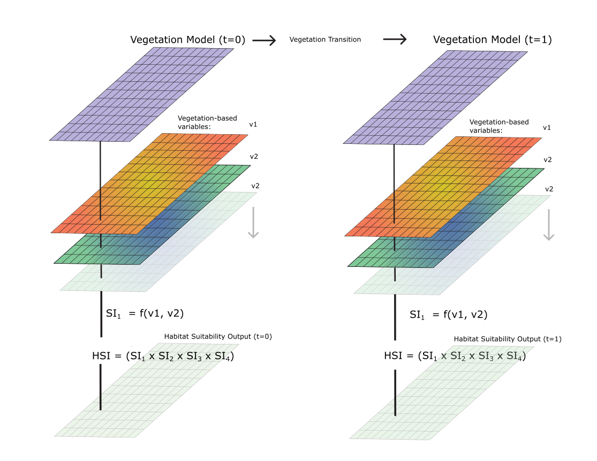

# CPRA HSI & Vegetation Models
___
This repo contains code for the Habitat Suitability Modeling (HSI) task, and the vegetation transition model, which serves as a partial basis for the HSI data input.

___
### `VegProcessor/`
Description: This folder contains code for processing inputs and executing the vegetation transition model, as well as the subsequent HSI model implementation. It handles input data preprocessing, vegetation type transitions based on environmental conditions (e.g., water depth, salinity), and generating outputs for analysis and visualization. The `VegTransition` model is designed to simulate vegetation dynamics over time and provide inputs for Habitat Suitability Index (HSI) models.

#### Contents:
- `veg_transition.py`: Framework for vegetation transition modeling, implementing rules and conditions for vegetation type changes over time. The `VegTransition` class is initialized with a `config.yaml` which defines the model parameters. The `run()` method executes the model.
- `hsi.py`: Framework for running the HSI models over the domain. `HSI` is a child class of `VegTransition` and inherits much of it's functionality for updating state variables over time.
- `batch_run.py`: Script for running multiple VegTransition and HSI scenarios in batch mode with automatic validation of outputs.
- `veg_logic.py`: Detailed implementation of vegetation transition rules, handling specific conditions and constraints for various vegetation types.
- `test.py`: Unit testing of vegetation zone logic.
- `utils.py`: General utility functions for working with file paths, datasets, and common logic used throughout the model. Includes functions to generate the 25-year sequenves. Also includes runtime testing that occurs during execution.
- `plotting.py`: Tools for visualizing input data, transition results, and model outputs.
- `run.ipynb`: Example workflow demonstrating how to execute the vegetation model, HSI models, and post processing of results.

___
#### `VegProcessor/configs`

- Configuration files for defining a vegetation transition model run.

___
#### `VegProcessor/sequences`
- CSV files defining the ordering of analog years with the 25 year sequences.

___
#### `VegProcessor/species_hsi`
Description: this folder contains the individual species HSI logic.
#### Contents:
- `alligator.py`
- `baldeagle.py`
- `bass.py`
- `blackbear.py`
- `blackcrappie.py`
- `blhwva.py`
- `bluecrab.py`
- `catfish.py`
- `crawfish.py`
- `gizzardshad.py`
- `swampwva.py`

___
#### `scripts/`
Description: Utility scripts for data preprocessing and conversion.
#### Contents:
- `nc_to_zarr.py`: Converts raw hydrologic NetCDF files to Zarr format, handling CRS normalization and optional reprojection to a reference grid.

___
### Setup for Model Runs & Development

#### **1. Clone the Repository**

Ensure **Git** is installed, then open a terminal and run:

```bash
git clone https://github.com/LynkerIntel/cpra-hsi.git
cd cpra-hsi
```

---

#### **2. Set Up the Environment with uv**

This project uses [uv](https://docs.astral.sh/uv/) for dependency management. Dependencies are defined in `pyproject.toml` and locked in `uv.lock`.

Install uv if you don't have it:

```bash
curl -LsSf https://astral.sh/uv/install.sh | sh
```

Create the virtual environment and install dependencies:

```bash
uv sync
```

Activate the environment:

```bash
source .venv/bin/activate
```
Alternatively, prepend commands with `uv run`; such as `uv run batch_run.py`.

---

#### **3. Configure the Model**

In order to run scenarios (i.e. base or sea level rise), config files must be created for each desired run, for both `VegTransition` and `HSI`.

`post_process()` methods are included for both classes. These may evolve over time, but are generally for (1) reducing model output to only necessary vars, periods, or locations, and (2) summarizing the results. They also include generating metrics (such as summary CSVs) or arrays required to calculate metrics (metrics inputs). Currently, C.W. runs the metrics code. This may change. 

- `VegProcessor/veg_config_**`: Specifies vegetation transition model settings, raster data paths, and output locations.
- `VegProcessor/hsi_config_**`: Defines parameters for running the Habitat Suitability Index model.

Configs for D.R.s runs live at: https://github.com/LynkerIntel/cpra-config


#### **4. Preprocess Hydrologic Input Data (NetCDF to Zarr)**

Raw hydrologic model outputs (from HEC-RAS, MIKE, or Delft3D) must be converted to Zarr format before running the models. The `scripts/nc_to_zarr.py` script handles this conversion and performs necessary preprocessing:

- Converts NetCDF files to Zarr stores for faster I/O
- Normalizes CRS metadata across different hydrologic model formats
- Renames spatial dimensions to standard `y`/`x` naming
- Optionally reprojects data to match a reference raster grid

There is variability in the NetCDFs produced by different modeling groups. This script should handle any variations (such as in variable naming) and create standardized Zarr store input to VegTransition and HSI.

**Basic usage:**

```bash
# Convert all .nc files in a directory to .zarr stores
uv run scripts/nc_to_zarr.py /path/to/hydro/netcdf_files/

# Specify a custom output directory
uv run scripts/nc_to_zarr.py /path/to/hydro/netcdf_files/ -o /path/to/zarr_output/

# Set time dimension chunk size (default: 1)
uv run scripts/nc_to_zarr.py /path/to/hydro/netcdf_files/ --time-chunks 10

# Reproject to match a reference raster (e.g., DEM grid)
uv run scripts/nc_to_zarr.py /path/to/hydro/netcdf_files/ --match-raster /path/to/dem.tif
```
In the current production workflow, all Zarr conversion use `/Users/dillonragar/data/cpra/60m_dem_1280_3200_padded.tif`. This file is available in the gdrive "run resources" folder, along with the
other static assets required. This is a version of the DEM which has been padded out to match the 60m model domain, defined by Royal Engineering.

**Example workflow:**

```bash
# Convert HEC-RAS stage outputs, reprojecting to match the 60m DEM
uv run scripts/nc_to_zarr.py /data/hydro/hec_stage/ --match-raster /data/rasters/60m_dem_1280_3200_padded.tif

# Convert MIKE salinity outputs
uv run scripts/nc_to_zarr.py /data/hydro/mike_salinity/ -o /data/zarr/mike_salinity_zarr/
```

By default, output Zarr stores are written to a sibling directory named `{input_dir}_zarr`. For example, converting `/data/hydro/hec_stage/` produces `/data/hydro/hec_stage_zarr/`.

After conversion, update your config files to point to the `.zarr` stores in the `stage_input_path` and `salinity_input_path` fields (and the other `*_input_path` keys as needed).

---

## Running Models

Once you have generates the input Zarr stores, there are two ways to run the models:
1. **Interactive (Notebook/Script)**: Run individual scenarios using Python
2. **Batch Mode**: Run multiple scenarios sequentially using `batch_run.py`

### Option 1: Interactive Execution

To execute the vegetation transition model:

```python
from VegProcessor.veg_transition import VegTransition

# Initialize the model with a config file
Veg = VegTransition(config_file="./configs/veg_config.yaml")

# Run the model
Veg.run()
Veg.post_process()  # optionally produce summaries
```

Keep in mind that the HSI models depend on the `VegTransition` output, and must always be executed second. To run the **Habitat Suitability Index (HSI)** model:

```python
from VegProcessor.hsi import HSI

# Initialize the HSI model
hsi = HSI(config_file="./configs/hsi_config.yaml")

# Run the model
hsi.run()
hsi.post_process()  # optionally produce summaries
```

These steps are also demonstrated in `./VegProcessor/run.ipynb`.

---

### Option 2: Batch Execution with `batch_run.py`

For running multiple scenarios (e.g., multiple hydrologic models, SLR conditions, and flow scenarios), use `batch_run.py`. This script automates the execution and validation of multiple model runs.

#### Setting Up Batch Runs

1. **Put the configs for the batch in a single directory.** The script discovers
   configs by filename prefix within that directory — no editing of
   `batch_run.py` is required:

   - `veg_*.yaml` → run as `VegTransition`
   - `hsi_*.yaml` → run as `HSI`

   Any other `.yaml` files in the directory are ignored.

2. **Run the batch script**, passing the config directory as the only argument:

```bash
cd VegProcessor
uv run batch_run.py /path/to/configs/
```

3. **Follow the interactive prompts**:

```
Found 4 veg configs and 4 hsi configs in /path/to/configs
Do you want to run Veg models? (y/n): y
Do you want to run HSI models? (y/n): y
```

If you answer "n" to both, you'll be prompted to validate existing outputs instead:

```
Do you want to validate existing outputs? (y/n): y
```

#### Code Branch Pinning

Configs may pin the code version they are meant to run against via
`metadata.code_branch`:

```yaml
metadata:
  code_branch: dr-dev
```

Before running anything, the script compares each pin against the current git
branch and exits with an error listing the mismatches if they disagree. Configs
that omit `code_branch` (or leave it empty) are not checked. A detached `HEAD`
counts as a mismatch for any config that sets a pin, so the intent has to be
made explicit. This argument typically is only used for running experiments, and is basically just a check to make sure the programmer has remembered to `git checkout` (i.e. switch) to the correct experimental code branch before running the model. It is not used in "production" runs typically, because the branch is unqiue to each output version. This brings us to versioning:

> [!NOTE]
> All production runs should occur on a "version branch", not main! This is to ensure each output is reproducible and can be traced to the codebase version. i.e. v36 outputs run on a branch called "dr-v36" or similar.


#### What Batch Run Does

The batch script performs the following for each config file:

1. **Executes the model** (`VegTransition` or `HSI`) with the specified config.
   A config that raises is recorded as a failure and the batch continues to the
   next one.
2. **Calls `post_process()`** to generate summaries
3. **Validates outputs** after all runs complete:
   - Checks that the expected NetCDF output files exist. `VegTransition` writes
     one file; `HSI` writes both the 480m file and the `_60m` file, and both
     must be present.
   - Verifies the time dimension has the expected number of timesteps
     (`VegTransition` includes the IC year, so it expects one more timestep
     than `HSI` for the same water year range).
   - Confirms the run loop actually produced output, by excluding known
     static/initial-condition variables (`veg_type`, `maturity`, `spatial_ref`,
     `crs`) and requiring at least one remaining time-varying variable that is
     not entirely NaN. This catches runs that aborted during the first `step()`
     but still wrote initial conditions.
4. **Prints a summary** showing successful and failed runs with error details,
   including the last entries from that run's `*_simulation.log`
5. **Exits non-zero** if any config failed, so the batch can be used in
   scripted/CI contexts

#### Example Output

```
Running VegTransition model for config: /path/to/veg_config_base_dry.yaml
Successfully completed VegTransition model for: /path/to/veg_config_base_dry.yaml

Validating VegTransition outputs...

============================================================
BATCH RUN RESULTS SUMMARY
============================================================

--- VegTransition Results ---

Successful (4/4):
  ✓ veg_config_base_dry.yaml
  ✓ veg_config_base_wet.yaml
  ✓ veg_config_1-08ft_slr_dry.yaml
  ✓ veg_config_1-08ft_slr_wet.yaml

--- HSI Results ---

Successful (3/4):
  ✓ hsi_config_base_dry.yaml
  ✓ hsi_config_base_wet.yaml
  ✓ hsi_config_1-08ft_slr_dry.yaml

Failed (1/4):
  ✗ hsi_config_1-08ft_slr_wet.yaml
    Reason: Time dim mismatch: expected 25, got 15
    Last log entries:
      2024-01-15 14:32:01 - Processing year 15...
      2024-01-15 14:32:45 - ERROR: Memory allocation failed

============================================================
!! 1 CONFIG(S) FAILED — see above !!
============================================================
```

#### Validation-Only Mode

To validate existing outputs without running any new models:

```bash
uv run batch_run.py /path/to/configs/
# Answer 'n' to both run prompts, then 'y' to validate
```

This is useful for:
- Checking the status of completed runs
- Debugging failed runs by examining log entries
- Verifying outputs after system interruptions

#### Execution Order

The batch script enforces the correct execution order:

1. All `VegTransition` models run first (if selected)
2. All `HSI` models run second (if selected)

This ensures HSI models have access to the required VegTransition outputs.

---

## Debugging & Logs

- Logs are stored in `output/run-metadata/simulation.log`
- Check logs if the model fails to run or if there are errors in output files.
- If running `VegTransition` or `HSI` in a notebook, the class instance (i.e. `hsi` as defined above) holds all of the intermediate and QA/QC arrays as attributes. For example: `hsi.alligator.si_1` is the location of suitability index #1 array for alligator. This array be be visualized by:

    ```python
    import matplotlib.pyplot as plt

    plt.matshow(hsi.alligator.si_1) # np.ndarray
    plt.colorbar()
    ```

---

## Cleaning Up

To deactivate the virtual environment:

```bash
deactivate
```
___
#### VegTransition
